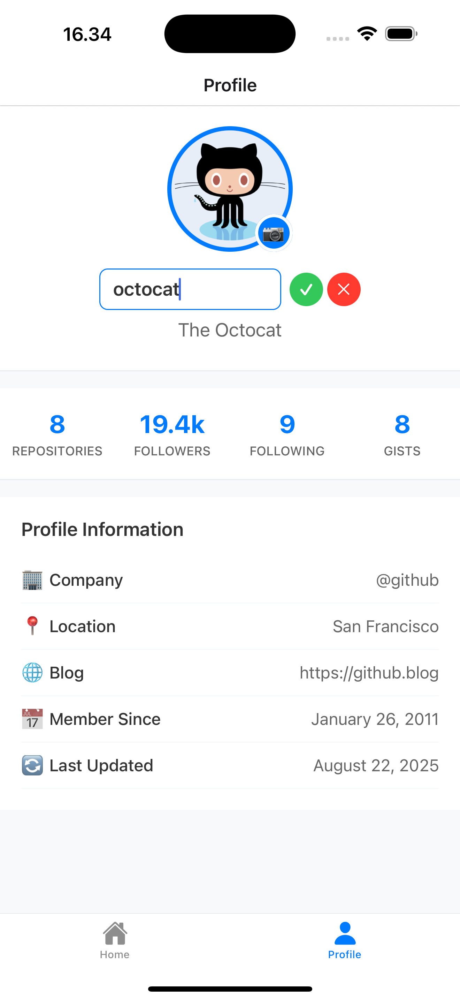

# GitHub App

A React Native application that interacts with GitHub API to display user profiles and repositories. Built with Redux Toolkit, React Native, and React Navigation.

---

## Table of Contents

- [Key Features](#key-features)
- [Installation](#installation)
- [Running the Application](#running-the-application)
- [Screenshots / Demo](#screenshots--demo)

---

## Key Features

- **User Profile:** View GitHub user profiles including name, avatar, location, bio, and stats.
- **Repository Listing:** Fetch and display user repositories with relevant details.
- **Redux Integration:** Global state management with Redux Toolkit for profile and repository data.
- **Async Loading & Error Handling:** Loading indicators while fetching data and error messages for failed requests.
- **Editable Username & Photo:** Update username and local profile photo.

---

## Installation

1. Clone the repository:

```bash
git clone https://github.com/reiteokki/github-mobile-app.git
cd github-mobile-app
```

## Running the Application

1. Run Expo:

```bash
npx expo start
```

2. Run Test:

```bash
npm test
```

3. Run Test with coverage:

```bash
npm run test -- --coverage
```

## Screenshots / Demo




